<!-- markdownlint-capture -->
<!-- markdownlint-disable -->

# Code Metrics

This file is dynamically maintained by a bot, *please do not* edit this by hand. It represents various [code metrics](https://aka.ms/dotnet/code-metrics), such as cyclomatic complexity, maintainability index, and so on.

## monument.api.client :heavy_check_mark:

The *monument.api.client.csproj* project file contains:

- 2 namespaces.
- 5 named types.
- 52 total lines of source code.
- Approximately 6 lines of executable code.
- The highest cyclomatic complexity is 2 :heavy_check_mark:.

  <strong id="monument-api-client">
    monument.api.client :heavy_check_mark:
  </strong>

 

The `monument.api.client` namespace contains 1 named types.

- 1 named types.
- 14 total lines of source code.
- Approximately 4 lines of executable code.
- The highest cyclomatic complexity is 1 :heavy_check_mark:.

  <strong id="monumentapiclient">
    MonumentApiClient :heavy_check_mark:
  </strong>

 

- The `MonumentApiClient` contains 1 members.
- 11 total lines of source code.
- Approximately 4 lines of executable code.
- The highest cyclomatic complexity is 1 :heavy_check_mark:.

| Member kind | Line number | Maintainability index | Cyclomatic complexity | Depth of inheritance | Class coupling | Lines of source / executable code |
| :-: | :-: | :-: | :-: | :-: | :-: | :-: |
| Method | <a href='https://github.com/aluitink/monument/blob/main/monument.api.client/MonumentApiClient.cs#L7' title='void MonumentApiClient.UpdateJsonSerializerSettings(JsonSerializerOptions settings)'>7</a> | 80 | 1 :heavy_check_mark: | 0 | 2 | 7 / 4 |

<a href="#MonumentApiClient-class-diagram">:link: to `MonumentApiClient` class diagram</a>

<a href="#monument-api-client">:top: back to monument.api.client</a>

  <strong id="monument-api-client-models">
    monument.api.client.Models :heavy_check_mark:
  </strong>

 

The `monument.api.client.Models` namespace contains 4 named types.

- 4 named types.
- 38 total lines of source code.
- Approximately 2 lines of executable code.
- The highest cyclomatic complexity is 2 :heavy_check_mark:.

  <strong id="blobgrant">
    BlobGrant :heavy_check_mark:
  </strong>

 

- The `BlobGrant` contains 2 members.
- 5 total lines of source code.
- Approximately 0 lines of executable code.
- The highest cyclomatic complexity is 2 :heavy_check_mark:.

| Member kind | Line number | Maintainability index | Cyclomatic complexity | Depth of inheritance | Class coupling | Lines of source / executable code |
| :-: | :-: | :-: | :-: | :-: | :-: | :-: |
| Property | <a href='https://github.com/aluitink/monument/blob/main/monument.api.client/Models/BlobGrant.cs#L5' title='string BlobGrant.BlobId'>5</a> | 100 | 2 :heavy_check_mark: | 0 | 0 | 1 / 0 |
| Property | <a href='https://github.com/aluitink/monument/blob/main/monument.api.client/Models/BlobGrant.cs#L6' title='string BlobGrant.UploadUri'>6</a> | 100 | 2 :heavy_check_mark: | 0 | 0 | 1 / 0 |

<a href="#BlobGrant-class-diagram">:link: to `BlobGrant` class diagram</a>

<a href="#monument-api-client-models">:top: back to monument.api.client.Models</a>

  <strong id="clientauthenticationdata">
    ClientAuthenticationData :heavy_check_mark:
  </strong>

 

- The `ClientAuthenticationData` contains 1 members.
- 4 total lines of source code.
- Approximately 0 lines of executable code.
- The highest cyclomatic complexity is 2 :heavy_check_mark:.

| Member kind | Line number | Maintainability index | Cyclomatic complexity | Depth of inheritance | Class coupling | Lines of source / executable code |
| :-: | :-: | :-: | :-: | :-: | :-: | :-: |
| Property | <a href='https://github.com/aluitink/monument/blob/main/monument.api.client/Models/ClientAuthenticationData.cs#L5' title='ClientPrincipal ClientAuthenticationData.ClientPrincipal'>5</a> | 100 | 2 :heavy_check_mark: | 0 | 1 | 1 / 0 |

<a href="#ClientAuthenticationData-class-diagram">:link: to `ClientAuthenticationData` class diagram</a>

<a href="#monument-api-client-models">:top: back to monument.api.client.Models</a>

  <strong id="clientprincipal">
    ClientPrincipal :heavy_check_mark:
  </strong>

 

- The `ClientPrincipal` contains 5 members.
- 11 total lines of source code.
- Approximately 2 lines of executable code.
- The highest cyclomatic complexity is 2 :heavy_check_mark:.

| Member kind | Line number | Maintainability index | Cyclomatic complexity | Depth of inheritance | Class coupling | Lines of source / executable code |
| :-: | :-: | :-: | :-: | :-: | :-: | :-: |
| Property | <a href='https://github.com/aluitink/monument/blob/main/monument.api.client/Models/ClientPrincipal.cs#L5' title='string? ClientPrincipal.IdentityProvider'>5</a> | 100 | 2 :heavy_check_mark: | 0 | 1 | 1 / 0 |
| Method | <a href='https://github.com/aluitink/monument/blob/main/monument.api.client/Models/ClientPrincipal.cs#L9' title='string ClientPrincipal.ToString()'>9</a> | 90 | 1 :heavy_check_mark: | 0 | 3 | 4 / 1 |
| Property | <a href='https://github.com/aluitink/monument/blob/main/monument.api.client/Models/ClientPrincipal.cs#L7' title='string? ClientPrincipal.UserDetails'>7</a> | 100 | 2 :heavy_check_mark: | 0 | 1 | 1 / 0 |
| Property | <a href='https://github.com/aluitink/monument/blob/main/monument.api.client/Models/ClientPrincipal.cs#L6' title='string? ClientPrincipal.UserId'>6</a> | 100 | 2 :heavy_check_mark: | 0 | 1 | 1 / 0 |
| Property | <a href='https://github.com/aluitink/monument/blob/main/monument.api.client/Models/ClientPrincipal.cs#L8' title='List<string> ClientPrincipal.UserRoles'>8</a> | 100 | 2 :heavy_check_mark: | 0 | 1 | 1 / 1 |

<a href="#ClientPrincipal-class-diagram">:link: to `ClientPrincipal` class diagram</a>

<a href="#monument-api-client-models">:top: back to monument.api.client.Models</a>

  <strong id="page">
    Page :heavy_check_mark:
  </strong>

 

- The `Page` contains 2 members.
- 6 total lines of source code.
- Approximately 0 lines of executable code.
- The highest cyclomatic complexity is 2 :heavy_check_mark:.

| Member kind | Line number | Maintainability index | Cyclomatic complexity | Depth of inheritance | Class coupling | Lines of source / executable code |
| :-: | :-: | :-: | :-: | :-: | :-: | :-: |
| Property | <a href='https://github.com/aluitink/monument/blob/main/monument.api.client/Models/Page.cs#L6' title='string Page.Markdown'>6</a> | 100 | 2 :heavy_check_mark: | 0 | 0 | 1 / 0 |
| Property | <a href='https://github.com/aluitink/monument/blob/main/monument.api.client/Models/Page.cs#L5' title='string Page.Name'>5</a> | 100 | 2 :heavy_check_mark: | 0 | 0 | 1 / 0 |

<a href="#Page-class-diagram">:link: to `Page` class diagram</a>

<a href="#monument-api-client-models">:top: back to monument.api.client.Models</a>

<a href="#monument-api-client">:top: back to monument.api.client</a>

## monument.api :heavy_check_mark:

The *monument.api.csproj* project file contains:

- 5 namespaces.
- 8 named types.
- 483 total lines of source code.
- Approximately 208 lines of executable code.
- The highest cyclomatic complexity is 6 :heavy_check_mark:.

  <strong id="global+namespace">
    &lt;global namespace&gt; :heavy_check_mark:
  </strong>

 

The `<global namespace>` namespace contains 1 named types.

- 1 named types.
- 56 total lines of source code.
- Approximately 20 lines of executable code.
- The highest cyclomatic complexity is 1 :heavy_check_mark:.

  <strong id="program$">
    &lt;Program&gt;$ :heavy_check_mark:
  </strong>

 

- The `<Program>$` contains 1 members.
- 56 total lines of source code.
- Approximately 20 lines of executable code.
- The highest cyclomatic complexity is 1 :heavy_check_mark:.

| Member kind | Line number | Maintainability index | Cyclomatic complexity | Depth of inheritance | Class coupling | Lines of source / executable code |
| :-: | :-: | :-: | :-: | :-: | :-: | :-: |
| Method | <a href='https://github.com/aluitink/monument/blob/main/monument.api/Program.cs#L1' title='<top-level-statements-entry-point>'>1</a> | 63 | 1 :heavy_check_mark: | 0 | 7 | 56 / 10 |

<a href="#global+namespace">:top: back to &lt;global namespace&gt;</a>

  <strong id="monument-api">
    monument.api :heavy_check_mark:
  </strong>

 

The `monument.api` namespace contains 3 named types.

- 3 named types.
- 180 total lines of source code.
- Approximately 74 lines of executable code.
- The highest cyclomatic complexity is 3 :heavy_check_mark:.

  <strong id="apibase">
    ApiBase :heavy_check_mark:
  </strong>

 

- The `ApiBase` contains 7 members.
- 58 total lines of source code.
- Approximately 18 lines of executable code.
- The highest cyclomatic complexity is 3 :heavy_check_mark:.

| Member kind | Line number | Maintainability index | Cyclomatic complexity | Depth of inheritance | Class coupling | Lines of source / executable code |
| :-: | :-: | :-: | :-: | :-: | :-: | :-: |
| Method | <a href='https://github.com/aluitink/monument/blob/main/monument.api/Apis/ApiBase.cs#L13' title='ApiBase.ApiBase()'>13</a> | 94 | 1 :heavy_check_mark: | 0 | 2 | 10 / 1 |
| Method | <a href='https://github.com/aluitink/monument/blob/main/monument.api/Apis/ApiBase.cs#L24' title='Task<string> ApiBase.EnsureAuthenticationAsync(HttpRequest request, CancellationToken cancellationToken = null)'>24</a> | 74 | 2 :heavy_check_mark: | 0 | 6 | 7 / 4 |
| Method | <a href='https://github.com/aluitink/monument/blob/main/monument.api/Apis/ApiBase.cs#L31' title='Task<ClientPrincipal> ApiBase.GetClientPrincipalAsync(HttpRequest request, CancellationToken cancellationToken = null)'>31</a> | 85 | 1 :heavy_check_mark: | 0 | 6 | 4 / 2 |
| Method | <a href='https://github.com/aluitink/monument/blob/main/monument.api/Apis/ApiBase.cs#L36' title='Task<ClaimsPrincipal> ApiBase.GetIdentityAsync(HttpRequest request, CancellationToken cancellationToken = null)'>36</a> | 85 | 1 :heavy_check_mark: | 0 | 6 | 4 / 2 |
| Method | <a href='https://github.com/aluitink/monument/blob/main/monument.api/Apis/ApiBase.cs#L40' title='Task<string> ApiBase.GetUserIdFromRequestAsync(HttpRequest request, CancellationToken cancellationToken = null)'>40</a> | 74 | 2 :heavy_check_mark: | 0 | 5 | 6 / 4 |
| Method | <a href='https://github.com/aluitink/monument/blob/main/monument.api/Apis/ApiBase.cs#L46' title='Task<T> ApiBase.ObjectFromRequestAsync<T>(HttpRequest request, CancellationToken cancellationToken = null)'>46</a> | 71 | 3 :heavy_check_mark: | 0 | 5 | 19 / 5 |
| Property | <a href='https://github.com/aluitink/monument/blob/main/monument.api/Apis/ApiBase.cs#L11' title='JsonSerializerOptions ApiBase.SerializerOptions'>11</a> | 100 | 2 :heavy_check_mark: | 0 | 1 | 1 / 0 |

<a href="#ApiBase-class-diagram">:link: to `ApiBase` class diagram</a>

<a href="#monument-api">:top: back to monument.api</a>

  <strong id="blobapi">
    BlobApi :heavy_check_mark:
  </strong>

 

- The `BlobApi` contains 4 members.
- 32 total lines of source code.
- Approximately 12 lines of executable code.
- The highest cyclomatic complexity is 1 :heavy_check_mark:.

| Member kind | Line number | Maintainability index | Cyclomatic complexity | Depth of inheritance | Class coupling | Lines of source / executable code |
| :-: | :-: | :-: | :-: | :-: | :-: | :-: |
| Field | <a href='https://github.com/aluitink/monument/blob/main/monument.api/Apis/BlobApi.cs#L15' title='BlobService BlobApi._blobService'>15</a> | 100 | 0 :heavy_check_mark: | 0 | 1 | 1 / 0 |
| Field | <a href='https://github.com/aluitink/monument/blob/main/monument.api/Apis/BlobApi.cs#L16' title='ILogger<BlobApi> BlobApi._logger'>16</a> | 100 | 0 :heavy_check_mark: | 0 | 1 | 1 / 0 |
| Method | <a href='https://github.com/aluitink/monument/blob/main/monument.api/Apis/BlobApi.cs#L18' title='BlobApi.BlobApi(BlobService blobService, ILogger<BlobApi> logger)'>18</a> | 85 | 1 :heavy_check_mark: | 0 | 2 | 5 / 2 |
| Method | <a href='https://github.com/aluitink/monument/blob/main/monument.api/Apis/BlobApi.cs#L31' title='Task<IActionResult> BlobApi.GetBlobUploadUriAsync(HttpRequest req, string containerId, string blobId)'>31</a> | 62 | 1 :heavy_check_mark: | 0 | 16 | 20 / 10 |

<a href="#BlobApi-class-diagram">:link: to `BlobApi` class diagram</a>

<a href="#monument-api">:top: back to monument.api</a>

  <strong id="pageapi">
    PageApi :heavy_check_mark:
  </strong>

 

- The `PageApi` contains 6 members.
- 81 total lines of source code.
- Approximately 44 lines of executable code.
- The highest cyclomatic complexity is 3 :heavy_check_mark:.

| Member kind | Line number | Maintainability index | Cyclomatic complexity | Depth of inheritance | Class coupling | Lines of source / executable code |
| :-: | :-: | :-: | :-: | :-: | :-: | :-: |
| Field | <a href='https://github.com/aluitink/monument/blob/main/monument.api/Apis/PageApi.cs#L15' title='BlobService PageApi._blobService'>15</a> | 100 | 0 :heavy_check_mark: | 0 | 1 | 1 / 0 |
| Method | <a href='https://github.com/aluitink/monument/blob/main/monument.api/Apis/PageApi.cs#L17' title='PageApi.PageApi(BlobService blobService)'>17</a> | 96 | 1 :heavy_check_mark: | 0 | 1 | 4 / 1 |
| Method | <a href='https://github.com/aluitink/monument/blob/main/monument.api/Apis/PageApi.cs#L82' title='Task<IActionResult> PageApi.DeletePageAsync(HttpRequest req, string pageName)'>82</a> | 63 | 3 :heavy_check_mark: | 0 | 15 | 16 / 10 |
| Method | <a href='https://github.com/aluitink/monument/blob/main/monument.api/Apis/PageApi.cs#L40' title='Task<IActionResult> PageApi.GetPageAsync(HttpRequest req, string pageName)'>40</a> | 64 | 1 :heavy_check_mark: | 0 | 15 | 15 / 9 |
| Method | <a href='https://github.com/aluitink/monument/blob/main/monument.api/Apis/PageApi.cs#L26' title='Task<IActionResult> PageApi.GetPagesAsync(HttpRequest req)'>26</a> | 66 | 2 :heavy_check_mark: | 0 | 16 | 13 / 8 |
| Method | <a href='https://github.com/aluitink/monument/blob/main/monument.api/Apis/PageApi.cs#L58' title='Task<IActionResult> PageApi.SetPageAsync(HttpRequest req)'>58</a> | 56 | 3 :heavy_check_mark: | 0 | 22 | 25 / 16 |

<a href="#PageApi-class-diagram">:link: to `PageApi` class diagram</a>

<a href="#monument-api">:top: back to monument.api</a>

  <strong id="monument-api-app">
    monument.api.App :heavy_check_mark:
  </strong>

 

The `monument.api.App` namespace contains 1 named types.

- 1 named types.
- 8 total lines of source code.
- Approximately 0 lines of executable code.
- The highest cyclomatic complexity is 2 :heavy_check_mark:.

  <strong id="apisettings">
    ApiSettings :heavy_check_mark:
  </strong>

 

- The `ApiSettings` contains 2 members.
- 5 total lines of source code.
- Approximately 0 lines of executable code.
- The highest cyclomatic complexity is 2 :heavy_check_mark:.

| Member kind | Line number | Maintainability index | Cyclomatic complexity | Depth of inheritance | Class coupling | Lines of source / executable code |
| :-: | :-: | :-: | :-: | :-: | :-: | :-: |
| Property | <a href='https://github.com/aluitink/monument/blob/main/monument.api/App/ApiSettings.cs#L5' title='string ApiSettings.StorageConnectionString'>5</a> | 100 | 2 :heavy_check_mark: | 0 | 0 | 1 / 0 |
| Property | <a href='https://github.com/aluitink/monument/blob/main/monument.api/App/ApiSettings.cs#L6' title='string ApiSettings.StorageUrl'>6</a> | 100 | 2 :heavy_check_mark: | 0 | 0 | 1 / 0 |

<a href="#ApiSettings-class-diagram">:link: to `ApiSettings` class diagram</a>

<a href="#monument-api-app">:top: back to monument.api.App</a>

  <strong id="monument-api-app-helpers">
    monument.api.App.Helpers :heavy_check_mark:
  </strong>

 

The `monument.api.App.Helpers` namespace contains 1 named types.

- 1 named types.
- 42 total lines of source code.
- Approximately 21 lines of executable code.
- The highest cyclomatic complexity is 6 :heavy_check_mark:.

  <strong id="staticwebappsauth">
    StaticWebAppsAuth :heavy_check_mark:
  </strong>

 

- The `StaticWebAppsAuth` contains 2 members.
- 39 total lines of source code.
- Approximately 21 lines of executable code.
- The highest cyclomatic complexity is 6 :heavy_check_mark:.

| Member kind | Line number | Maintainability index | Cyclomatic complexity | Depth of inheritance | Class coupling | Lines of source / executable code |
| :-: | :-: | :-: | :-: | :-: | :-: | :-: |
| Method | <a href='https://github.com/aluitink/monument/blob/main/monument.api/App/Helpers/StaticWebAppsAuth.cs#L24' title='ClaimsPrincipal StaticWebAppsAuth.GetClaimsPrincipal(HttpRequest req)'>24</a> | 59 | 6 :heavy_check_mark: | 0 | 8 | 23 / 14 |
| Method | <a href='https://github.com/aluitink/monument/blob/main/monument.api/App/Helpers/StaticWebAppsAuth.cs#L11' title='ClientPrincipal StaticWebAppsAuth.GetClientPrincipal(HttpRequest req)'>11</a> | 68 | 2 :heavy_check_mark: | 0 | 5 | 12 / 7 |

<a href="#StaticWebAppsAuth-class-diagram">:link: to `StaticWebAppsAuth` class diagram</a>

<a href="#monument-api-app-helpers">:top: back to monument.api.App.Helpers</a>

  <strong id="monument-api-app-services">
    monument.api.App.Services :heavy_check_mark:
  </strong>

 

The `monument.api.App.Services` namespace contains 2 named types.

- 2 named types.
- 197 total lines of source code.
- Approximately 93 lines of executable code.
- The highest cyclomatic complexity is 4 :heavy_check_mark:.

  <strong id="blobservice">
    BlobService :heavy_check_mark:
  </strong>

 

- The `BlobService` contains 14 members.
- 141 total lines of source code.
- Approximately 69 lines of executable code.
- The highest cyclomatic complexity is 4 :heavy_check_mark:.

| Member kind | Line number | Maintainability index | Cyclomatic complexity | Depth of inheritance | Class coupling | Lines of source / executable code |
| :-: | :-: | :-: | :-: | :-: | :-: | :-: |
| Field | <a href='https://github.com/aluitink/monument/blob/main/monument.api/App/Services/BlobService.cs#L14' title='ApiSettings BlobService._apiSettings'>14</a> | 100 | 0 :heavy_check_mark: | 0 | 1 | 1 / 0 |
| Field | <a href='https://github.com/aluitink/monument/blob/main/monument.api/App/Services/BlobService.cs#L15' title='ILogger<BlobService> BlobService._logger'>15</a> | 100 | 0 :heavy_check_mark: | 0 | 1 | 1 / 0 |
| Method | <a href='https://github.com/aluitink/monument/blob/main/monument.api/App/Services/BlobService.cs#L16' title='BlobService.BlobService(IOptions<ApiSettings> apiSettings, ILogger<BlobService> logger)'>16</a> | 85 | 1 :heavy_check_mark: | 0 | 4 | 5 / 2 |
| Method | <a href='https://github.com/aluitink/monument/blob/main/monument.api/App/Services/BlobService.cs#L95' title='Uri BlobService.BuildStorageUri(string container, string blobId)'>95</a> | 82 | 2 :heavy_check_mark: | 0 | 4 | 6 / 2 |
| Method | <a href='https://github.com/aluitink/monument/blob/main/monument.api/App/Services/BlobService.cs#L65' title='Task<Uri> BlobService.CreateBlobAsync(string containerId, string blobId, Stream sourceStream, CancellationToken cancellationToken = null)'>65</a> | 60 | 4 :heavy_check_mark: | 0 | 10 | 23 / 11 |
| Method | <a href='https://github.com/aluitink/monument/blob/main/monument.api/App/Services/BlobService.cs#L118' title='Uri BlobService.CreateBlobSharedAccessSignatureUri(BlobClient blobClient, string storedPolicyName = null)'>118</a> | 62 | 3 :heavy_check_mark: | 0 | 5 | 34 / 11 |
| Method | <a href='https://github.com/aluitink/monument/blob/main/monument.api/App/Services/BlobService.cs#L88' title='Task<bool> BlobService.DeleteBlobAsync(string containerId, string blobId, CancellationToken cancellationToken = null)'>88</a> | 71 | 1 :heavy_check_mark: | 0 | 5 | 7 / 5 |
| Method | <a href='https://github.com/aluitink/monument/blob/main/monument.api/App/Services/BlobService.cs#L32' title='Task<string> BlobService.FetchBlobAsync(string containerId, string blobId, Stream destinationStream, CancellationToken cancellationToken = null)'>32</a> | 68 | 1 :heavy_check_mark: | 0 | 6 | 8 / 6 |
| Method | <a href='https://github.com/aluitink/monument/blob/main/monument.api/App/Services/BlobService.cs#L21' title='IAsyncEnumerable<string> BlobService.FetchBlobListAsync(string containerId, CancellationToken cancellationToken = null)'>21</a> | 68 | 2 :heavy_check_mark: | 0 | 8 | 11 / 7 |
| Method | <a href='https://github.com/aluitink/monument/blob/main/monument.api/App/Services/BlobService.cs#L112' title='Task<BlobClient> BlobService.GetBlobClientAsync(string containerId, string blobId, CancellationToken cancellationToken = null)'>112</a> | 73 | 1 :heavy_check_mark: | 0 | 6 | 6 / 4 |
| Method | <a href='https://github.com/aluitink/monument/blob/main/monument.api/App/Services/BlobService.cs#L101' title='Task<BlobContainerClient> BlobService.GetBlobContainerClientAsync(string containerId, CancellationToken cancellationToken = null)'>101</a> | 69 | 2 :heavy_check_mark: | 0 | 6 | 11 / 6 |
| Method | <a href='https://github.com/aluitink/monument/blob/main/monument.api/App/Services/BlobService.cs#L41' title='Task<bool> BlobService.GetBlobExistsAsync(string containerId, string blobId, CancellationToken cancellationToken = null)'>41</a> | 69 | 1 :heavy_check_mark: | 0 | 5 | 8 / 6 |
| Method | <a href='https://github.com/aluitink/monument/blob/main/monument.api/App/Services/BlobService.cs#L58' title='Task<Uri> BlobService.GetBlobUploadUriAsync(string containerId, string blobId, CancellationToken cancellationToken = null)'>58</a> | 73 | 1 :heavy_check_mark: | 0 | 6 | 6 / 4 |
| Method | <a href='https://github.com/aluitink/monument/blob/main/monument.api/App/Services/BlobService.cs#L50' title='Task<Uri> BlobService.GetBlobUriAsync(string containerId, string blobId, CancellationToken cancellationToken = null)'>50</a> | 71 | 1 :heavy_check_mark: | 0 | 6 | 7 / 5 |

<a href="#BlobService-class-diagram">:link: to `BlobService` class diagram</a>

<a href="#monument-api-app-services">:top: back to monument.api.App.Services</a>

  <strong id="pageservice">
    PageService :heavy_check_mark:
  </strong>

 

- The `PageService` contains 10 members.
- 50 total lines of source code.
- Approximately 24 lines of executable code.
- The highest cyclomatic complexity is 2 :heavy_check_mark:.

| Member kind | Line number | Maintainability index | Cyclomatic complexity | Depth of inheritance | Class coupling | Lines of source / executable code |
| :-: | :-: | :-: | :-: | :-: | :-: | :-: |
| Field | <a href='https://github.com/aluitink/monument/blob/main/monument.api/App/Services/PageService.cs#L12' title='ApiSettings PageService._apiSettings'>12</a> | 100 | 0 :heavy_check_mark: | 0 | 1 | 1 / 0 |
| Field | <a href='https://github.com/aluitink/monument/blob/main/monument.api/App/Services/PageService.cs#L11' title='BlobService PageService._blobService'>11</a> | 100 | 0 :heavy_check_mark: | 0 | 1 | 1 / 0 |
| Field | <a href='https://github.com/aluitink/monument/blob/main/monument.api/App/Services/PageService.cs#L13' title='ILogger<PageService> PageService._logger'>13</a> | 100 | 0 :heavy_check_mark: | 0 | 1 | 1 / 0 |
| Method | <a href='https://github.com/aluitink/monument/blob/main/monument.api/App/Services/PageService.cs#L17' title='PageService.PageService(BlobService blobService, IOptions<ApiSettings> apiSettings, ILogger<PageService> logger)'>17</a> | 79 | 1 :heavy_check_mark: | 0 | 5 | 6 / 3 |
| Method | <a href='https://github.com/aluitink/monument/blob/main/monument.api/App/Services/PageService.cs#L41' title='Task<Page> PageService.CreateOrUpdatePageAsync(Page page, JsonSerializerOptions options = null, CancellationToken cancellationToken = null)'>41</a> | 63 | 2 :heavy_check_mark: | 0 | 8 | 12 / 8 |
| Method | <a href='https://github.com/aluitink/monument/blob/main/monument.api/App/Services/PageService.cs#L54' title='Task<bool> PageService.DeletePageAsync(string pageName, CancellationToken cancellationToken = null)'>54</a> | 80 | 1 :heavy_check_mark: | 0 | 4 | 4 / 2 |
| Method | <a href='https://github.com/aluitink/monument/blob/main/monument.api/App/Services/PageService.cs#L31' title='Task<Page?> PageService.GetPageAsync(string pageName, JsonSerializerOptions options = null, CancellationToken cancellationToken = null)'>31</a> | 67 | 1 :heavy_check_mark: | 0 | 8 | 10 / 6 |
| Method | <a href='https://github.com/aluitink/monument/blob/main/monument.api/App/Services/PageService.cs#L24' title='IAsyncEnumerable<string> PageService.GetPagesAsync(CancellationToken cancellationToken = null)'>24</a> | 77 | 2 :heavy_check_mark: | 0 | 5 | 7 / 3 |
| Field | <a href='https://github.com/aluitink/monument/blob/main/monument.api/App/Services/PageService.cs#L15' title='string PageService.PageContainerName'>15</a> | 93 | 0 :heavy_check_mark: | 0 | 0 | 1 / 1 |
| Field | <a href='https://github.com/aluitink/monument/blob/main/monument.api/App/Services/PageService.cs#L16' title='string PageService.PageStorageFormat'>16</a> | 93 | 0 :heavy_check_mark: | 0 | 0 | 1 / 1 |

<a href="#PageService-class-diagram">:link: to `PageService` class diagram</a>

<a href="#monument-api-app-services">:top: back to monument.api.App.Services</a>

<a href="#monument-api">:top: back to monument.api</a>

## monument.ui :x:

The *monument.ui.csproj* project file contains:

- 3 namespaces.
- 8 named types.
- 453 total lines of source code.
- Approximately 147 lines of executable code.
- The highest cyclomatic complexity is 14 :x:.

  <strong id="global+namespace">
    &lt;global namespace&gt; :heavy_check_mark:
  </strong>

 

The `<global namespace>` namespace contains 2 named types.

- 2 named types.
- 51 total lines of source code.
- Approximately 34 lines of executable code.
- The highest cyclomatic complexity is 4 :heavy_check_mark:.

  <strong id="program$">
    &lt;Program&gt;$ :heavy_check_mark:
  </strong>

 

- The `<Program>$` contains 1 members.
- 47 total lines of source code.
- Approximately 34 lines of executable code.
- The highest cyclomatic complexity is 4 :heavy_check_mark:.

| Member kind | Line number | Maintainability index | Cyclomatic complexity | Depth of inheritance | Class coupling | Lines of source / executable code |
| :-: | :-: | :-: | :-: | :-: | :-: | :-: |
| Method | <a href='https://github.com/aluitink/monument/blob/main/monument.ui/Program.cs#L1' title='<top-level-statements-entry-point>'>1</a> | 57 | 4 :heavy_check_mark: | 0 | 5 | 47 / 17 |

<a href="#global+namespace">:top: back to &lt;global namespace&gt;</a>

  <strong id="monumentsettings">
    MonumentSettings :heavy_check_mark:
  </strong>

 

- The `MonumentSettings` contains 2 members.
- 4 total lines of source code.
- Approximately 0 lines of executable code.
- The highest cyclomatic complexity is 2 :heavy_check_mark:.

| Member kind | Line number | Maintainability index | Cyclomatic complexity | Depth of inheritance | Class coupling | Lines of source / executable code |
| :-: | :-: | :-: | :-: | :-: | :-: | :-: |
| Property | <a href='https://github.com/aluitink/monument/blob/main/monument.ui/Models/MonumentSettings.cs#L3' title='string MonumentSettings.ApiUrl'>3</a> | 100 | 2 :heavy_check_mark: | 0 | 0 | 1 / 0 |
| Property | <a href='https://github.com/aluitink/monument/blob/main/monument.ui/Models/MonumentSettings.cs#L4' title='string MonumentSettings.AuthenticationDataUrl'>4</a> | 100 | 2 :heavy_check_mark: | 0 | 0 | 1 / 0 |

<a href="#MonumentSettings-class-diagram">:link: to `MonumentSettings` class diagram</a>

<a href="#global+namespace">:top: back to &lt;global namespace&gt;</a>

  <strong id="monument-ui-client">
    monument.ui.Client :heavy_check_mark:
  </strong>

 

The `monument.ui.Client` namespace contains 2 named types.

- 2 named types.
- 92 total lines of source code.
- Approximately 33 lines of executable code.
- The highest cyclomatic complexity is 7 :heavy_check_mark:.

  <strong id="monumentauthenticationstateprovider-authcacheobject">
    MonumentAuthenticationStateProvider.AuthCacheObject :heavy_check_mark:
  </strong>

 

- The `MonumentAuthenticationStateProvider.AuthCacheObject` contains 3 members.
- 12 total lines of source code.
- Approximately 2 lines of executable code.
- The highest cyclomatic complexity is 3 :heavy_check_mark:.

| Member kind | Line number | Maintainability index | Cyclomatic complexity | Depth of inheritance | Class coupling | Lines of source / executable code |
| :-: | :-: | :-: | :-: | :-: | :-: | :-: |
| Method | <a href='https://github.com/aluitink/monument/blob/main/monument.ui/Client/MonumentAuthenticationStateProvider.cs#L18' title='bool AuthCacheObject.IsValid()'>18</a> | 81 | 3 :heavy_check_mark: | 0 | 3 | 6 / 2 |
| Property | <a href='https://github.com/aluitink/monument/blob/main/monument.ui/Client/MonumentAuthenticationStateProvider.cs#L15' title='AuthenticationState AuthCacheObject.State'>15</a> | 100 | 2 :heavy_check_mark: | 0 | 1 | 1 / 0 |
| Property | <a href='https://github.com/aluitink/monument/blob/main/monument.ui/Client/MonumentAuthenticationStateProvider.cs#L16' title='DateTimeOffset AuthCacheObject.ValidTo'>16</a> | 100 | 2 :heavy_check_mark: | 0 | 1 | 1 / 0 |

<a href="#MonumentAuthenticationStateProvider.AuthCacheObject-class-diagram">:link: to `MonumentAuthenticationStateProvider.AuthCacheObject` class diagram</a>

<a href="#monument-ui-client">:top: back to monument.ui.Client</a>

  <strong id="monumentauthenticationstateprovider">
    MonumentAuthenticationStateProvider :heavy_check_mark:
  </strong>

 

- The `MonumentAuthenticationStateProvider` contains 9 members.
- 89 total lines of source code.
- Approximately 31 lines of executable code.
- The highest cyclomatic complexity is 7 :heavy_check_mark:.

| Member kind | Line number | Maintainability index | Cyclomatic complexity | Depth of inheritance | Class coupling | Lines of source / executable code |
| :-: | :-: | :-: | :-: | :-: | :-: | :-: |
| Field | <a href='https://github.com/aluitink/monument/blob/main/monument.ui/Client/MonumentAuthenticationStateProvider.cs#L31' title='ConcurrentDictionary<string, AuthCacheObject> MonumentAuthenticationStateProvider._authenticationCache'>31</a> | 93 | 0 :heavy_check_mark: | 0 | 2 | 1 / 1 |
| Field | <a href='https://github.com/aluitink/monument/blob/main/monument.ui/Client/MonumentAuthenticationStateProvider.cs#L27' title='IHttpClientFactory MonumentAuthenticationStateProvider._httpClientFactory'>27</a> | 100 | 0 :heavy_check_mark: | 0 | 1 | 1 / 0 |
| Field | <a href='https://github.com/aluitink/monument/blob/main/monument.ui/Client/MonumentAuthenticationStateProvider.cs#L28' title='NavigationManager MonumentAuthenticationStateProvider._navigationManager'>28</a> | 100 | 0 :heavy_check_mark: | 0 | 1 | 1 / 0 |
| Field | <a href='https://github.com/aluitink/monument/blob/main/monument.ui/Client/MonumentAuthenticationStateProvider.cs#L32' title='SemaphoreSlim MonumentAuthenticationStateProvider._resolverSemaphore'>32</a> | 93 | 0 :heavy_check_mark: | 0 | 1 | 1 / 1 |
| Field | <a href='https://github.com/aluitink/monument/blob/main/monument.ui/Client/MonumentAuthenticationStateProvider.cs#L26' title='MonumentSettings MonumentAuthenticationStateProvider._settings'>26</a> | 100 | 0 :heavy_check_mark: | 0 | 1 | 1 / 0 |
| Method | <a href='https://github.com/aluitink/monument/blob/main/monument.ui/Client/MonumentAuthenticationStateProvider.cs#L34' title='MonumentAuthenticationStateProvider.MonumentAuthenticationStateProvider(IOptions<MonumentSettings> options, IHttpClientFactory httpClientFactory, NavigationManager navigationManager)'>34</a> | 79 | 1 :heavy_check_mark: | 0 | 5 | 6 / 3 |
| Field | <a href='https://github.com/aluitink/monument/blob/main/monument.ui/Client/MonumentAuthenticationStateProvider.cs#L30' title='int MonumentAuthenticationStateProvider.AuthenticationStateValidityOffsetInMinutes'>30</a> | 93 | 0 :heavy_check_mark: | 0 | 0 | 1 / 1 |
| Method | <a href='https://github.com/aluitink/monument/blob/main/monument.ui/Client/MonumentAuthenticationStateProvider.cs#L41' title='Task<AuthenticationState> MonumentAuthenticationStateProvider.GetAuthenticationStateAsync()'>41</a> | 60 | 4 :heavy_check_mark: | 0 | 12 | 30 / 12 |
| Method | <a href='https://github.com/aluitink/monument/blob/main/monument.ui/Client/MonumentAuthenticationStateProvider.cs#L72' title='Task MonumentAuthenticationStateProvider.PopulateAuthCacheAsync(string authUrl, AuthCacheObject authState)'>72</a> | 57 | 7 :heavy_check_mark: | 0 | 10 | 27 / 14 |

<a href="#MonumentAuthenticationStateProvider-class-diagram">:link: to `MonumentAuthenticationStateProvider` class diagram</a>

<a href="#monument-ui-client">:top: back to monument.ui.Client</a>

  <strong id="monument-ui-components">
    monument.ui.Components :x:
  </strong>

 

The `monument.ui.Components` namespace contains 4 named types.

- 4 named types.
- 310 total lines of source code.
- Approximately 80 lines of executable code.
- The highest cyclomatic complexity is 14 :x:.

  <strong id="markdownsection">
    MarkdownSection :heavy_check_mark:
  </strong>

 

- The `MarkdownSection` contains 13 members.
- 125 total lines of source code.
- Approximately 33 lines of executable code.
- The highest cyclomatic complexity is 5 :heavy_check_mark:.

| Member kind | Line number | Maintainability index | Cyclomatic complexity | Depth of inheritance | Class coupling | Lines of source / executable code |
| :-: | :-: | :-: | :-: | :-: | :-: | :-: |
| Field | <a href='https://github.com/aluitink/monument/blob/main/monument.ui/Components/MarkdownSection.razor.cs#L11' title='string? MarkdownSection._content'>11</a> | 100 | 0 :heavy_check_mark: | 0 | 1 | 1 / 0 |
| Field | <a href='https://github.com/aluitink/monument/blob/main/monument.ui/Components/MarkdownSection.razor.cs#L12' title='string? MarkdownSection._fromAsset'>12</a> | 100 | 0 :heavy_check_mark: | 0 | 1 | 1 / 0 |
| Field | <a href='https://github.com/aluitink/monument/blob/main/monument.ui/Components/MarkdownSection.razor.cs#L9' title='IJSObjectReference MarkdownSection._jsModule'>9</a> | 93 | 0 :heavy_check_mark: | 0 | 1 | 1 / 1 |
| Field | <a href='https://github.com/aluitink/monument/blob/main/monument.ui/Components/MarkdownSection.razor.cs#L10' title='bool MarkdownSection._markdownChanged'>10</a> | 93 | 0 :heavy_check_mark: | 0 | 0 | 1 / 1 |
| Property | <a href='https://github.com/aluitink/monument/blob/main/monument.ui/Components/MarkdownSection.razor.cs#L24' title='string? MarkdownSection.Content'>24</a> | 89 | 4 :heavy_check_mark: | 0 | 3 | 19 / 4 |
| Method | <a href='https://github.com/aluitink/monument/blob/main/monument.ui/Components/MarkdownSection.razor.cs#L112' title='MarkupString MarkdownSection.ConvertToMarkupString(string? value)'>112</a> | 73 | 2 :heavy_check_mark: | 0 | 4 | 19 / 6 |
| Property | <a href='https://github.com/aluitink/monument/blob/main/monument.ui/Components/MarkdownSection.razor.cs#L41' title='string? MarkdownSection.FromAsset'>41</a> | 89 | 4 :heavy_check_mark: | 0 | 3 | 16 / 4 |
| Property | <a href='https://github.com/aluitink/monument/blob/main/monument.ui/Components/MarkdownSection.razor.cs#L57' title='MarkupString MarkdownSection.HtmlContent'>57</a> | 100 | 2 :heavy_check_mark: | 0 | 1 | 1 / 0 |
| Property | <a href='https://github.com/aluitink/monument/blob/main/monument.ui/Components/MarkdownSection.razor.cs#L15' title='IJSRuntime MarkdownSection.JSRuntime'>15</a> | 100 | 2 :heavy_check_mark: | 0 | 2 | 2 / 1 |
| Method | <a href='https://github.com/aluitink/monument/blob/main/monument.ui/Components/MarkdownSection.razor.cs#L98' title='Task<MarkupString> MarkdownSection.MarkdownToMarkupStringAsync()'>98</a> | 76 | 2 :heavy_check_mark: | 0 | 4 | 18 / 4 |
| Method | <a href='https://github.com/aluitink/monument/blob/main/monument.ui/Components/MarkdownSection.razor.cs#L67' title='Task MarkdownSection.OnAfterRenderAsync(bool firstRender)'>67</a> | 63 | 5 :heavy_check_mark: | 0 | 7 | 26 / 10 |
| Property | <a href='https://github.com/aluitink/monument/blob/main/monument.ui/Components/MarkdownSection.razor.cs#L55' title='EventCallback MarkdownSection.OnContentConverted'>55</a> | 100 | 2 :heavy_check_mark: | 0 | 2 | 2 / 0 |
| Method | <a href='https://github.com/aluitink/monument/blob/main/monument.ui/Components/MarkdownSection.razor.cs#L59' title='void MarkdownSection.OnInitialized()'>59</a> | 84 | 3 :heavy_check_mark: | 0 | 4 | 7 / 2 |

<a href="#MarkdownSection-class-diagram">:link: to `MarkdownSection` class diagram</a>

<a href="#monument-ui-components">:top: back to monument.ui.Components</a>

  <strong id="markdownsectionprecodeextension">
    MarkdownSectionPreCodeExtension :heavy_check_mark:
  </strong>

 

- The `MarkdownSectionPreCodeExtension` contains 2 members.
- 28 total lines of source code.
- Approximately 6 lines of executable code.
- The highest cyclomatic complexity is 3 :heavy_check_mark:.

| Member kind | Line number | Maintainability index | Cyclomatic complexity | Depth of inheritance | Class coupling | Lines of source / executable code |
| :-: | :-: | :-: | :-: | :-: | :-: | :-: |
| Method | <a href='https://github.com/aluitink/monument/blob/main/monument.ui/Components/MarkdownSectionPreCodeExtension.cs#L9' title='void MarkdownSectionPreCodeExtension.Setup(MarkdownPipelineBuilder pipeline)'>9</a> | 100 | 1 :heavy_check_mark: | 0 | 1 | 3 / 0 |
| Method | <a href='https://github.com/aluitink/monument/blob/main/monument.ui/Components/MarkdownSectionPreCodeExtension.cs#L13' title='void MarkdownSectionPreCodeExtension.Setup(MarkdownPipeline pipeline, IMarkdownRenderer renderer)'>13</a> | 70 | 3 :heavy_check_mark: | 0 | 8 | 21 / 6 |

<a href="#MarkdownSectionPreCodeExtension-class-diagram">:link: to `MarkdownSectionPreCodeExtension` class diagram</a>

<a href="#monument-ui-components">:top: back to monument.ui.Components</a>

  <strong id="markdownsectionprecoderenderer">
    MarkdownSectionPreCodeRenderer :x:
  </strong>

 

- The `MarkdownSectionPreCodeRenderer` contains 9 members.
- 133 total lines of source code.
- Approximately 41 lines of executable code.
- The highest cyclomatic complexity is 14 :x:.

| Member kind | Line number | Maintainability index | Cyclomatic complexity | Depth of inheritance | Class coupling | Lines of source / executable code |
| :-: | :-: | :-: | :-: | :-: | :-: | :-: |
| Field | <a href='https://github.com/aluitink/monument/blob/main/monument.ui/Components/MarkdownSectionPreCodeRenderer.cs#L21' title='HashSet<string>? MarkdownSectionPreCodeRenderer._blocksAsDiv'>21</a> | 100 | 0 :heavy_check_mark: | 0 | 2 | 1 / 0 |
| Field | <a href='https://github.com/aluitink/monument/blob/main/monument.ui/Components/MarkdownSectionPreCodeRenderer.cs#L22' title='MarkdownSectionPreCodeRendererOptions? MarkdownSectionPreCodeRenderer._options'>22</a> | 100 | 0 :heavy_check_mark: | 0 | 1 | 1 / 0 |
| Method | <a href='https://github.com/aluitink/monument/blob/main/monument.ui/Components/MarkdownSectionPreCodeRenderer.cs#L24' title='MarkdownSectionPreCodeRenderer.MarkdownSectionPreCodeRenderer(MarkdownSectionPreCodeRendererOptions? options)'>24</a> | 96 | 1 :heavy_check_mark: | 0 | 1 | 4 / 1 |
| Property | <a href='https://github.com/aluitink/monument/blob/main/monument.ui/Components/MarkdownSectionPreCodeRenderer.cs#L33' title='HashSet<string> MarkdownSectionPreCodeRenderer.BlocksAsDiv'>33</a> | 100 | 2 :heavy_check_mark: | 0 | 3 | 4 / 2 |
| Property | <a href='https://github.com/aluitink/monument/blob/main/monument.ui/Components/MarkdownSectionPreCodeRenderer.cs#L28' title='bool MarkdownSectionPreCodeRenderer.OutputAttributesOnPre'>28</a> | 100 | 2 :heavy_check_mark: | 0 | 0 | 1 / 0 |
| Method | <a href='https://github.com/aluitink/monument/blob/main/monument.ui/Components/MarkdownSectionPreCodeRenderer.cs#L35' title='void MarkdownSectionPreCodeRenderer.Write(HtmlRenderer renderer, CodeBlock obj)'>35</a> | 53 | 14 :x: | 0 | 8 | 52 / 19 |
| Method | <a href='https://github.com/aluitink/monument/blob/main/monument.ui/Components/MarkdownSectionPreCodeRenderer.cs#L100' title='void MarkdownSectionPreCodeRenderer.WriteCodeAttributes(HtmlRenderer renderer, CodeBlock obj, string? codeGenericAttributes)'>100</a> | 76 | 2 :heavy_check_mark: | 0 | 5 | 11 / 4 |
| Method | <a href='https://github.com/aluitink/monument/blob/main/monument.ui/Components/MarkdownSectionPreCodeRenderer.cs#L111' title='void MarkdownSectionPreCodeRenderer.WriteElementAttributes(HtmlRenderer renderer, HtmlAttributes? fromCodeBlock, string? genericAttributes)'>111</a> | 62 | 8 :warning: | 0 | 6 | 31 / 11 |
| Method | <a href='https://github.com/aluitink/monument/blob/main/monument.ui/Components/MarkdownSectionPreCodeRenderer.cs#L88' title='void MarkdownSectionPreCodeRenderer.WritePreAttributes(HtmlRenderer renderer, CodeBlock obj, string? preGenericAttributes)'>88</a> | 76 | 2 :heavy_check_mark: | 0 | 5 | 11 / 4 |

<a href="#MarkdownSectionPreCodeRenderer-class-diagram">:link: to `MarkdownSectionPreCodeRenderer` class diagram</a>

<a href="#monument-ui-components">:top: back to monument.ui.Components</a>

  <strong id="markdownsectionprecoderendereroptions">
    MarkdownSectionPreCodeRendererOptions :heavy_check_mark:
  </strong>

 

- The `MarkdownSectionPreCodeRendererOptions` contains 2 members.
- 14 total lines of source code.
- Approximately 0 lines of executable code.
- The highest cyclomatic complexity is 0 :heavy_check_mark:.

| Member kind | Line number | Maintainability index | Cyclomatic complexity | Depth of inheritance | Class coupling | Lines of source / executable code |
| :-: | :-: | :-: | :-: | :-: | :-: | :-: |
| Field | <a href='https://github.com/aluitink/monument/blob/main/monument.ui/Components/MarkdownSectionPreCodeRendererOptions.cs#L15' title='string? MarkdownSectionPreCodeRendererOptions.CodeTagAttributes'>15</a> | 100 | 0 :heavy_check_mark: | 0 | 1 | 1 / 0 |
| Field | <a href='https://github.com/aluitink/monument/blob/main/monument.ui/Components/MarkdownSectionPreCodeRendererOptions.cs#L11' title='string? MarkdownSectionPreCodeRendererOptions.PreTagAttributes'>11</a> | 100 | 0 :heavy_check_mark: | 0 | 1 | 1 / 0 |

<a href="#MarkdownSectionPreCodeRendererOptions-class-diagram">:link: to `MarkdownSectionPreCodeRendererOptions` class diagram</a>

<a href="#monument-ui-components">:top: back to monument.ui.Components</a>

<a href="#monument-ui">:top: back to monument.ui</a>

## Metric definitions

  - **Maintainability index**: Measures ease of code maintenance. Higher values are better.
  - **Cyclomatic complexity**: Measures the number of branches. Lower values are better.
  - **Depth of inheritance**: Measures length of object inheritance hierarchy. Lower values are better.
  - **Class coupling**: Measures the number of classes that are referenced. Lower values are better.
  - **Lines of source code**: Exact number of lines of source code. Lower values are better.
  - **Lines of executable code**: Approximates the lines of executable code. Lower values are better.

## Mermaid class diagrams

##### `MonumentApiClient` class diagram

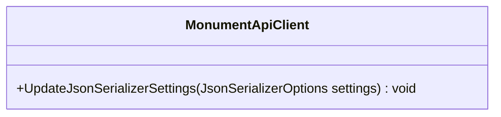

##### `BlobGrant` class diagram

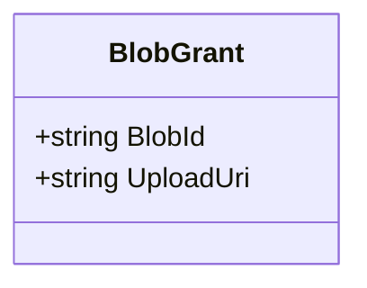

##### `ClientAuthenticationData` class diagram

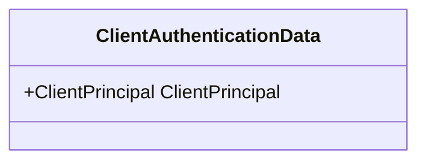

##### `ClientPrincipal` class diagram

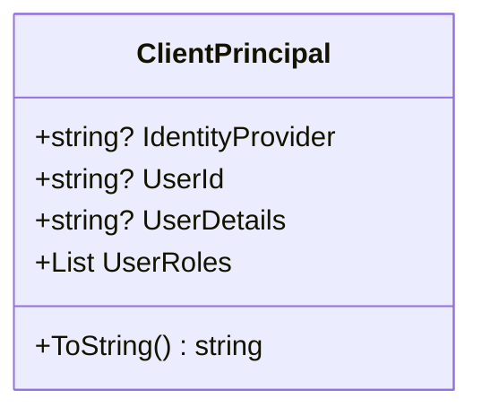

##### `Page` class diagram

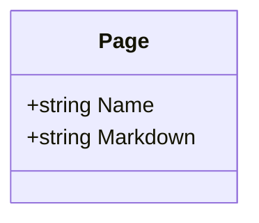

##### `ApiBase` class diagram

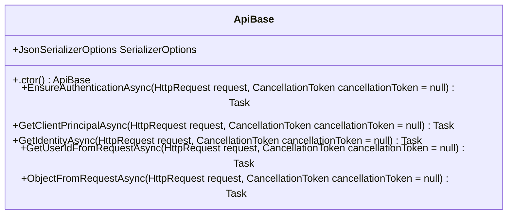

##### `BlobApi` class diagram

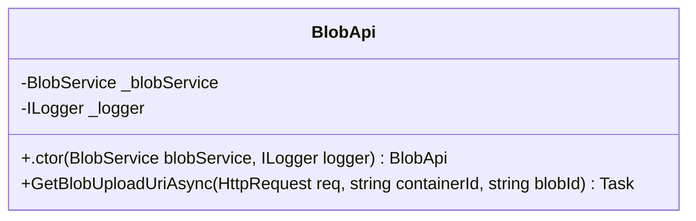

##### `PageApi` class diagram

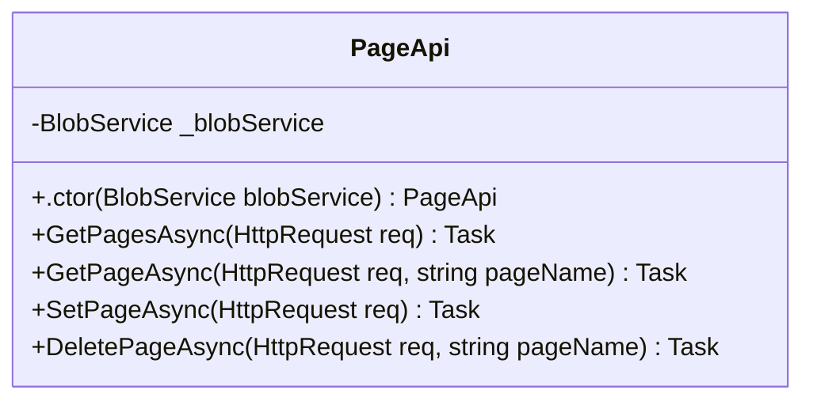

##### `ApiSettings` class diagram

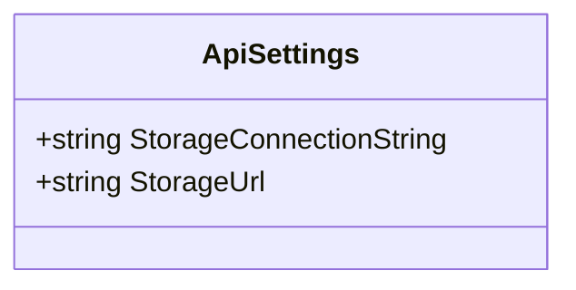

##### `StaticWebAppsAuth` class diagram

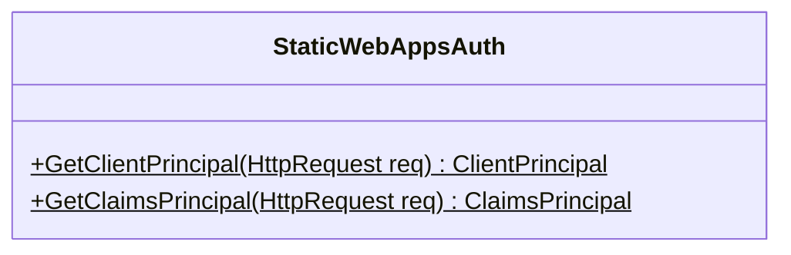

##### `BlobService` class diagram

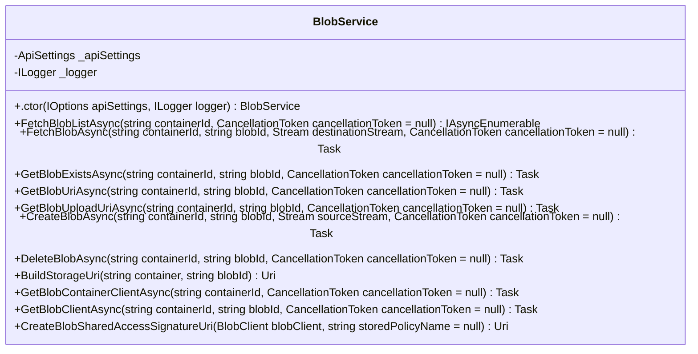

##### `PageService` class diagram

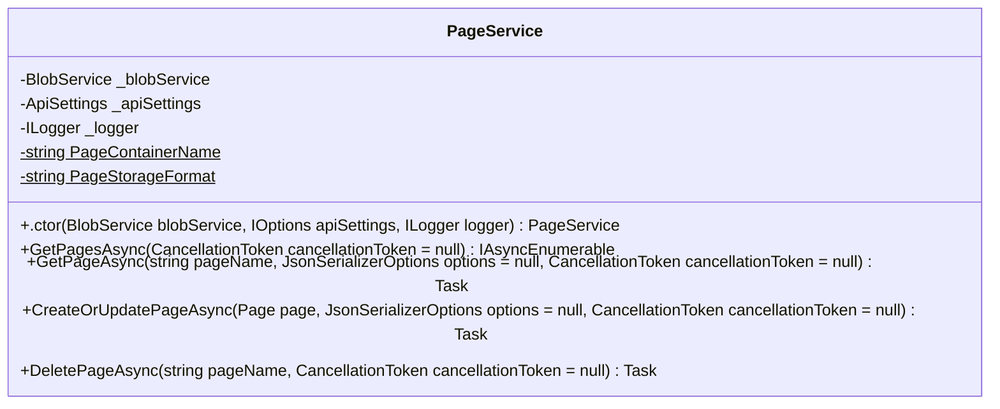

##### `MonumentSettings` class diagram

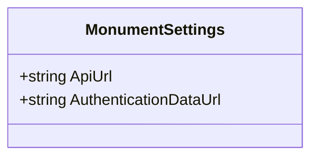

##### `MonumentAuthenticationStateProvider.AuthCacheObject` class diagram

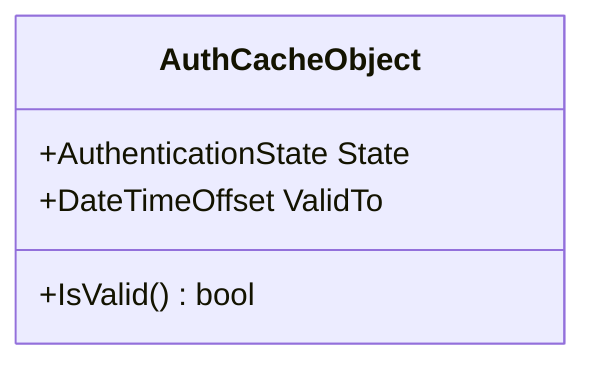

##### `MonumentAuthenticationStateProvider` class diagram

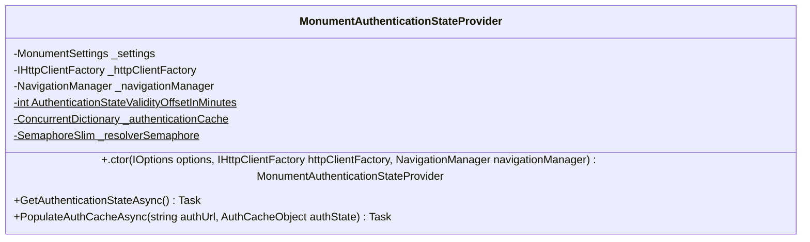

##### `MarkdownSection` class diagram

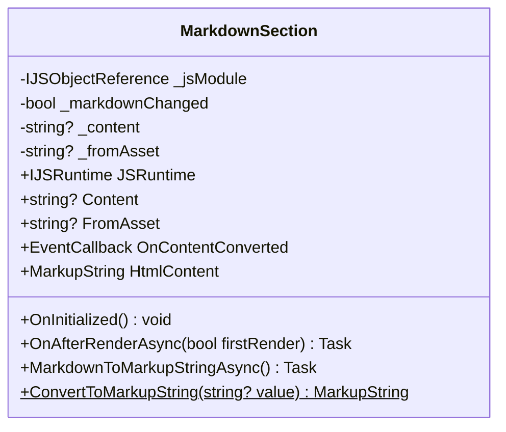

##### `MarkdownSectionPreCodeExtension` class diagram

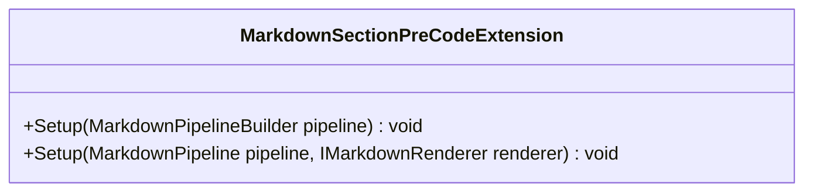

##### `MarkdownSectionPreCodeRenderer` class diagram

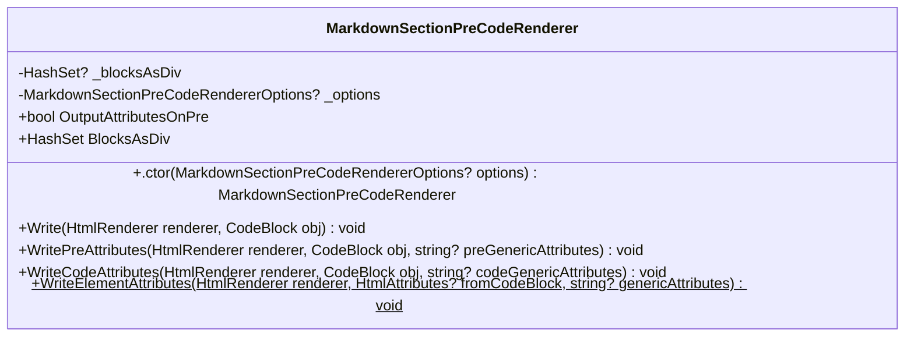

##### `MarkdownSectionPreCodeRendererOptions` class diagram

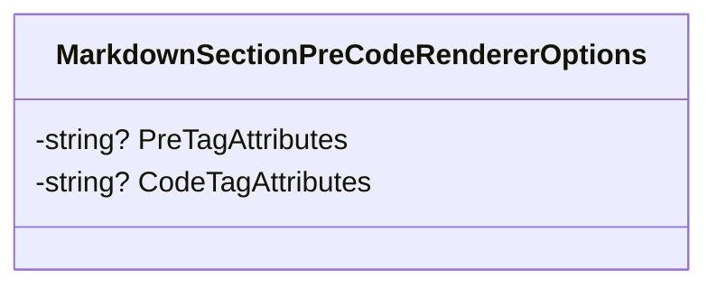

*This file is maintained by a bot.*

<!-- markdownlint-restore -->
